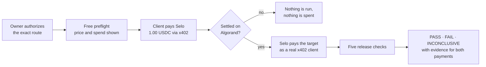
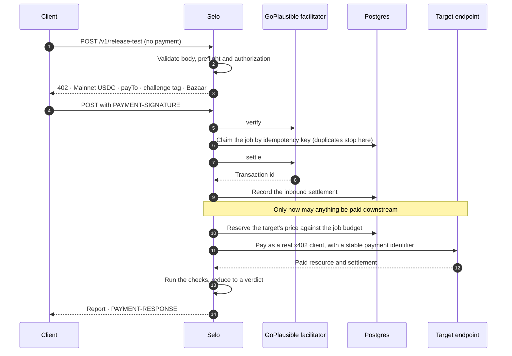
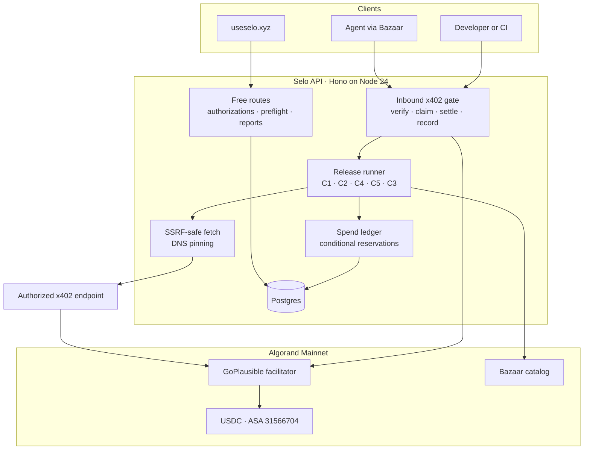
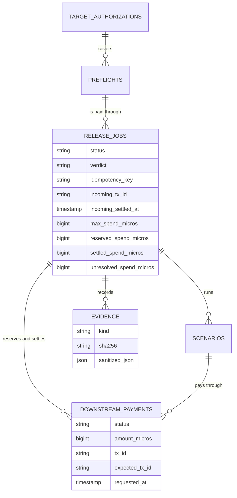

# Selo

[](https://github.com/Enoch208/selo/actions/workflows/ci.yml)

**Selo is CI for x402. It pays your endpoint before your users do.**

Before you ship a paid x402 endpoint, Selo buys from it. It makes one real, capped payment on
Algorand Mainnet as a genuine client, checks the payment and the delivery against a release
contract, and returns a deterministic **PASS**, **FAIL** or **INCONCLUSIVE** verdict backed by the
transactions on both sides.

- **Live site:** https://useselo.xyz
- **Live API:** https://api.useselo.xyz (paid route `POST /v1/release-test`, 1.00 USDC)
- **Proof on chain:** Selo was paid in round
  [65454635](https://allo.info/tx/JXU2INATXUJHE7WZGGWN25BPM6L2YEL6Q7LU5W3HICI4B5CX4JAQ), then paid
  the target in round [65454637](https://allo.info/tx/ATF5HLYBBY4G5GYPNLCUMC5FXH22WIXI2QG3YP7M4WYPA5EHQTYQ)
- **Claims ledger:** [`docs/CLAIMS.md`](docs/CLAIMS.md), every public claim with its evidence
- **Machine-readable:** [`/llms.txt`](https://api.useselo.xyz/llms.txt) ·
  [`/.well-known/agent-card.json`](https://api.useselo.xyz/.well-known/agent-card.json)

---

## Contents

- [The problem](#the-problem)
- [What Selo does](#what-selo-does)
- [How it works](#how-it-works)
- [The paid route](#the-paid-route)
- [The five checks](#the-five-checks)
- [The verdict](#the-verdict)
- [Guarantees](#guarantees)
- [The verified Mainnet run](#the-verified-mainnet-run)
- [Architecture](#architecture)
- [Data model](#data-model)
- [API](#api)
- [Tech stack](#tech-stack)
- [Running it yourself](#running-it-yourself)
- [Testing](#testing)
- [Project layout](#project-layout)
- [Known limitations](#known-limitations)

---

## The problem

x402 puts payment directly into the HTTP request, and that creates a new way to ship a broken
release. An endpoint can pass every health check and still fail the moment a real buyer pays:

- the 402 asks for the wrong asset, network or payee;
- the payment settles but the paid resource never arrives;
- a retried request settles a second time, or serves a paid side effect twice;
- the Bazaar listing describes a method, URL or price the live route no longer honours, so machine
  clients cannot call it.

Ordinary API tests never make a real payment, so none of this shows up until a customer, or an
autonomous agent, pays and gets nothing.

## What Selo does

Selo treats a payment interaction as a release contract and tests it the only way that counts:
by paying.

The product rests on one boundary:

> **Selo never spends before it has been paid, never spends past the job's cap, and never calls
> anything it cannot prove a PASS.**

The verdict is deterministic code. No model decides PASS or FAIL.

## How it works



1. **Authorize.** The endpoint's owner proves control of the exact route, by serving a one-time
   token at `/.well-known/selo-verification.txt` or through a recorded manual consent. Selo never
   infers consent, and an authorization expires after 24 hours.
2. **Preflight, free.** Selo makes one unpaid request, reads the target's 402 and its Bazaar
   listing, and rejects the test before anyone pays if the target is private, unauthorized, on the
   wrong network or asset, or priced above the job budget.
3. **Pay Selo.** The client calls `POST /v1/release-test` and pays 1.00 USDC through x402. The
   route is listed in Bazaar and attributed to the `x402-global-challenge`.
4. **Selo pays the target.** Only after its own payment has settled and the transaction is
   recorded, Selo reserves the exact amount against the job's budget, signs exactly the requirement
   the target offered, and pays it.
5. **Report.** Selo runs the five checks and returns a verdict with both transaction ids, a private
   report link and a sanitized evidence packet.

## The paid route

The stock x402 middleware for Hono settles _after_ the handler runs. That order cannot support an
Orchestrator, so Selo composes the steps explicitly and a test fails if they are ever reordered.



A settlement whose outcome is unknown (a facilitator timeout, a 5xx, a pending result that still
carries a transaction) is **held**, never discarded. The client is told not to pay again, the job
never runs, and the transaction id is stored for reconciliation. A client can never be charged
twice for one logical request.

## The five checks

| Check                     | What PASS means                                                                                                         | What fails it                                                                         |
| ------------------------- | ----------------------------------------------------------------------------------------------------------------------- | ------------------------------------------------------------------------------------- |
| **C1 Handshake**          | The unpaid request returns a valid x402 v2 402 with an Algorand USDC requirement, a valid payTo and a parseable price   | Not 402, a missing or malformed challenge, no supported requirement, an invalid payTo |
| **C2 Paid delivery**      | Selo's payment settled, the target's settlement id matches the transaction Selo signed, and the paid resource came back | Paid but not delivered; a valid payment rejected by the target                        |
| **C4 Response contract**  | The expected status, content type and optional JSON Schema all match                                                    | Any mismatch, or a non-JSON body when a schema is expected                            |
| **C5 Discovery contract** | The live 402 and the Bazaar listing agree on method, URL, payment terms and price                                       | The listing points at the wrong method, URL, payee or price                           |
| **C3 Retry / replay**     | Replaying the identical signed payment is rejected, or returns the target's stored result without a second settlement   | A replay produces a second paid side effect                                           |

The retry check re-sends the byte-identical payment and body. It records what the target actually
did and never claims universal idempotency.

## The verdict

```text
any blocking check FAIL with evidence            →  FAIL
anything missing, unproven or ambiguous          →  INCONCLUSIVE
every check proven, with evidence                →  PASS
```

**Unknown is never PASS.** A network outage, a facilitator timeout, a payment whose state is
unclear, an empty wallet on Selo's side or a lapsed authorization all end in INCONCLUSIVE with the
reason. A failure on Selo's side is never reported as a failure of the target. The reducer is a
pure function in [`packages/core/src/verdict.ts`](packages/core/src/verdict.ts).

## Guarantees

Each is enforced in code and covered by tests.

| Guarantee                                      | How                                                                                                                                                                                                          | Where                                                                              |
| ---------------------------------------------- | ------------------------------------------------------------------------------------------------------------------------------------------------------------------------------------------------------------ | ---------------------------------------------------------------------------------- |
| Selo never spends before it has been paid      | The runner starts only for a job whose inbound settlement is recorded; A12 checks the database timestamps and the call order                                                                                 | `apps/api/src/release/settle-and-run.ts`, `apps/api/src/orchestrator/job-state.ts` |
| Spend never exceeds the job's budget           | One conditional `UPDATE … WHERE settled + reserved + unresolved + amount ≤ max_spend` in the same transaction as the payment row, with a database CHECK as backstop; the job cap itself is at most 5.00 USDC | `apps/api/src/ledger/reserve.ts`, `apps/api/src/db/schema.ts`                      |
| Parallel attempts cannot overspend             | A16: three parallel 0.05 USDC reservations against a 0.10 job reserve exactly two, on separate connections to a real Postgres                                                                                | `apps/api/tests/ledger/concurrency.test.ts`                                        |
| Ambiguity stops spending                       | A payment whose outcome is unclear stays UNRESOLVED, counts against the budget and blocks every later reservation                                                                                            | `apps/api/src/orchestrator/paid-outcome.ts`                                        |
| Selo signs exactly what it reserved            | The signed requirement must match network, asset, amount and payee, and the SDK's spend cap is set to that amount                                                                                            | `apps/api/src/payments/accept-match.ts`, `apps/api/src/payments/sign.ts`           |
| A client is never charged twice                | The job is claimed before settlement; a duplicate or a retried request never settles again                                                                                                                   | `apps/api/src/release/idempotency.ts`, `apps/api/src/release/jobs.ts`              |
| No request without authorization               | A verified, unexpired authorization must cover the exact origin, route and method before the first probe and again before the replay                                                                         | `apps/api/src/orchestrator/recheck.ts`                                             |
| Selo cannot be turned against private networks | HTTPS only, DNS answers vetted and pinned per connection, private, loopback, link-local, CGNAT and metadata ranges refused, and a signed payment never follows a redirect                                    | `packages/core/src/target-url.ts`, `apps/api/src/net/`                             |
| No secret reaches evidence, logs or reports    | Payment signatures, credentials and wallet phrases are replaced by their hash; A22 scans every output of a full run                                                                                          | `apps/api/src/evidence/`, `apps/api/tests/e2e/`                                    |
| Reports are private                            | Each report sits behind an unguessable token, served with `noindex`, `no-store` and `no-referrer`                                                                                                            | `apps/api/src/reports/`                                                            |
| A restart never strands a paid job             | A sweep at boot concludes interrupted jobs, holds their open payments as unresolved and writes the report                                                                                                    | `apps/api/src/orchestrator/boot-sweep.ts`                                          |

## The verified Mainnet run

A real release test on Algorand Mainnet against [ORA Gate](https://ora-gate-mainnet.vercel.app/.well-known/x402),
an x402 messaging endpoint, run with its owner's permission. The owner agreed to be named.

| Step                                          | Measured on Mainnet                                                                                                                                                                                                                                                                              |
| --------------------------------------------- | ------------------------------------------------------------------------------------------------------------------------------------------------------------------------------------------------------------------------------------------------------------------------------------------------ |
| Customer pays Selo                            | 1.00 USDC, [`JXU2INAT…4JAQ`](https://allo.info/tx/JXU2INATXUJHE7WZGGWN25BPM6L2YEL6Q7LU5W3HICI4B5CX4JAQ), round 65454635                                                                                                                                                                          |
| Selo pays ORA Gate                            | 0.01 USDC, [`ATF5HLYB…QTYQ`](https://allo.info/tx/ATF5HLYBBY4G5GYPNLCUMC5FXH22WIXI2QG3YP7M4WYPA5EHQTYQ), round 65454637                                                                                                                                                                          |
| Handshake · paid delivery · response contract | PASS                                                                                                                                                                                                                                                                                             |
| Discovery contract                            | WARN: not yet catalogued, and Selo's own paid call is what listed the route in Bazaar                                                                                                                                                                                                            |
| Retry / replay                                | Reported as a possible duplicate. ORA Gate returned its stored result, but that version of Selo's check did not compare the replayed body with the original. ORA Gate's owner confirmed the message was delivered once, and the check now credits a byte-identical stored result as a safe retry |

**Retest, 30 September.** After the retry check was changed to compare replayed bodies, a second
release job against the same endpoint returned **PASS** on all five checks, including discovery
(consistent with the Bazaar listing) and retry (`PASS_SAFE_RETRY`): Selo was paid
[`M7UBNUG4…`](https://allo.info/tx/M7UBNUG4M6XAQBT7NBUFVDMCRGIK4IGYDUGLLATB5ADAS3RLMDTQ) (round
65538170), then paid ORA Gate
[`S2NOVVRD…`](https://allo.info/tx/S2NOVVRDZUPTY7AA3BZ3NDISYPNXNDMXEKX442SVNR7RXQCP3W7Q). These payments into Selo came from the Selo team's own wallet; they prove the product works end
to end, not outside demand.

The two payments sit two rounds apart, in order, on a public explorer. Selo is listed in the
Bazaar catalog and has a row on the `x402-global-challenge` leaderboard. Evidence for every step is
in [`docs/evidence/`](docs/evidence/README.md).

## Architecture



`packages/core` is the pure engine: the wire contract, integer micro-USDC money, the job, scenario
and payment state machines, the spend policy, the SSRF address rules and the five check evaluators.
It has no I/O, so it is tested without a network or a database. `apps/api` composes it with Postgres,
the official `@x402` packages and the facilitator.

## Data model



Money is integer micro-USDC everywhere. The full schema is in
[`apps/api/src/db/schema.ts`](apps/api/src/db/schema.ts).

## API

| Route                                                | Paid          | Purpose                                                    |
| ---------------------------------------------------- | ------------- | ---------------------------------------------------------- |
| `GET /health`                                        | no            | Liveness                                                   |
| `POST /v1/authorizations`                            | no            | Request a verification challenge for a target route        |
| `POST /v1/authorizations/:id/verify`                 | no            | Verify the well-known token                                |
| `POST /v1/preflight`                                 | no            | Check a target is testable and within budget before paying |
| `POST /v1/release-test`                              | **1.00 USDC** | Run the release test                                       |
| `GET /v1/reports/:token`                             | no            | Private report                                             |
| `GET /llms.txt` · `GET /.well-known/agent-card.json` | no            | Machine-readable description                               |

## Tech stack

| Layer      | Choice                                                                                                           |
| ---------- | ---------------------------------------------------------------------------------------------------------------- |
| Payments   | Official `@x402/core`, `@x402/avm`, `@x402/hono`, `@x402/extensions` 2.27 (Bazaar discovery, payment identifier) |
| Settlement | GoPlausible facilitator, USDC on Algorand Mainnet (ASA 31566704)                                                 |
| Chain      | algosdk 3.8                                                                                                      |
| API        | Hono 4.13 on Node 24, zod 4 at every edge                                                                        |
| Data       | PostgreSQL with Drizzle 0.45                                                                                     |
| Web        | React 19, TypeScript, Vite, Tailwind CSS 4                                                                       |
| Tests      | Vitest 5 against a real Postgres                                                                                 |
| Tooling    | pnpm 10 with exact pins, ESLint (strict type-checked), Prettier, GitHub Actions                                  |

## Running it yourself

You need Node 24, pnpm 10 and PostgreSQL.

```bash
pnpm install
cp apps/api/.env.example apps/api/.env      # set SELO_PAY_TO, SELO_OPERATOR_MNEMONIC, REPORT_TOKEN_SECRET
DATABASE_URL=postgres://… pnpm db:migrate
pnpm dev                                    # API on :8787
pnpm --filter @selo/web dev                 # the site, proxying the API
```

The environment is validated at startup. On Mainnet the server refuses to start without a public
HTTPS base URL, a valid payee and operating wallet, and a writable reports directory. Behind a
reverse proxy, allow at least 120 seconds per request: a paid release test waits for settlement and
for the downstream call.

Operator commands:

| Command                                                                  | What it does                                                                                                                  |
| ------------------------------------------------------------------------ | ----------------------------------------------------------------------------------------------------------------------------- |
| `pnpm --filter @selo/api consent:grant`                                  | Record an owner's explicit consent for a route                                                                                |
| `pnpm --filter @selo/api verify:g1`                                      | Read-only check of the live 402, the Bazaar listing, the merchant record and the leaderboard row                              |
| `pnpm --filter @selo/api pay:selo`                                       | Pay Selo once as a customer; prints price and payee first, refuses self-payment and refuses Mainnet without explicit approval |
| `pnpm --filter @selo/api account:new \| account:optin \| account:status` | Create, opt in and inspect wallets                                                                                            |

## Testing

**85 test files and 855 tests**, run on every push in GitHub Actions against a real Postgres.
The captured run is in [`docs/evidence/g3-test-suite.txt`](docs/evidence/g3-test-suite.txt).

| Folder                         | What it covers                                                                                                                            |
| ------------------------------ | ----------------------------------------------------------------------------------------------------------------------------------------- |
| `packages/core/tests/`         | Money, the three state machines, the verdict reducer, the spend policy with a seeded simulation of thousands of steps, SSRF address rules |
| `packages/core/tests/checks/`  | Every decision row of the five checks, including byte-real 402s captured from the SDK and a live Mainnet merchant                         |
| `apps/api/tests/release/`      | The paid route: the exact 402, rejections before payment, settle-before-run (A12), duplicate requests (A21), held settlements             |
| `apps/api/tests/ledger/`       | Reservations under true parallelism on separate connections, randomised interleavings, counters equal to sums                             |
| `apps/api/tests/orchestrator/` | The runner: every payment outcome, authorization lapses, wall-clock limits, restarts                                                      |
| `apps/api/tests/e2e/`          | The whole flow through the real app, gate, runner and ledger, with fakes only at the facilitator, the signer and the target               |
| `apps/api/tests/net/`          | Pinned DNS, redirect policy, header stripping and failure typing against a local HTTPS server                                             |
| `apps/api/tests/payments/`     | Signing exactly the reserved requirement, the payment identifier, replays and secret handling                                             |

Acceptance tests carry their ID in the title, so `pnpm test -t A16` runs one.

## Project layout

| Path                                  | What lives there                                                                                     |
| ------------------------------------- | ---------------------------------------------------------------------------------------------------- |
| `packages/core/src/`                  | The pure engine: contract, money, state machines, verdict, spend policy, SSRF rules, the five checks |
| `apps/api/src/release/`               | The paid route: validate, 402, verify, claim, settle, record, run                                    |
| `apps/api/src/payments/`              | The inbound gate and the downstream x402 client                                                      |
| `apps/api/src/orchestrator/`          | The release runner, its recovery paths and the restart sweep                                         |
| `apps/api/src/ledger/`                | Conditional reservations and payment transitions                                                     |
| `apps/api/src/net/`                   | The SSRF-safe fetch                                                                                  |
| `apps/api/src/evidence/` · `reports/` | Sanitized evidence, the report and the private report route                                          |
| `apps/api/src/tools/`                 | Operator commands                                                                                    |
| `apps/web/`                           | The site: landing, the test flow and report pages                                                    |
| `docs/`                               | The claims ledger and the evidence artifacts                                                         |
| `eslint-rules/`                       | A local lint rule that keeps the codebase free of comments                                           |

## Known limitations

- **Paying Selo needs an x402 client today.** The site walks through authorization and preflight,
  then gives the exact commands to pay with any x402 client; paying from a browser wallet is not
  built yet.
- **Unresolved payments are reconciled by hand.** A payment whose outcome is unclear is held, stops
  spending and stores its expected transaction id, but no job yet checks the chain and settles it
  automatically.
- **One external team so far.** ORA Gate is the only third-party endpoint tested on Mainnet. No outside
  team has paid for a test yet: every payment into Selo so far came from wallets controlled by the
  Selo team.
- **One profile.** `quick`, GET and POST targets, Algorand USDC only.
- **A release test is a single request.** It waits for settlement and the downstream call, so
  clients and proxies need generous timeouts.
